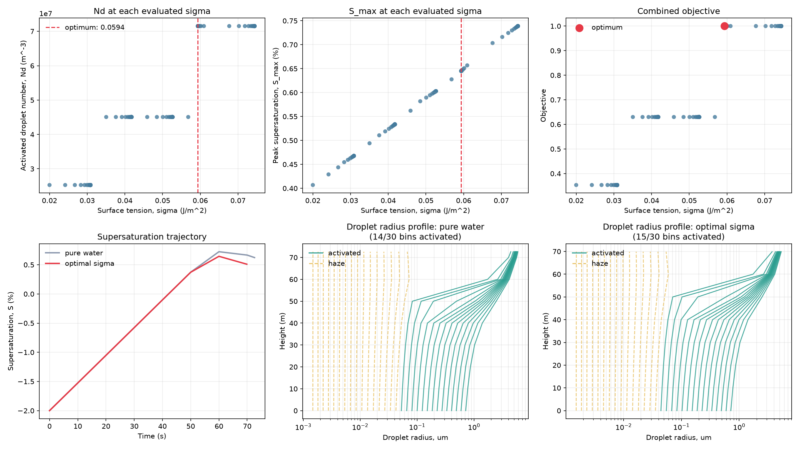

pyrcel: cloud parcel model
==========================
## 2026 Fork: Surface-Tension-Dependent Aerosol Activation

This fork extends `pyrcel` by adding a way to modify the surface tension of the aerosols and include it in calculations through the Köhler equation. 

Seq, Seq_approx, and every function downstream of them (equilibration, the per-timestep growth ODE, and the post-solve activation diagnostics) currently assume the Kelvin term uses pure water's surface tension via sigma_w(T), with no way to override it per species. This PR adds an optional sigma/sigmas/surf_tension parameter threaded through the full chain, so a species can specify its own surface tension. Without this, pyrcel, and most parcel models currently released to the public, had no way to represent that physically.

### Added functionality
- `thermo.py`: `Seq` and `Seq_approx` accept optional sigma
- `aerosol.py`: `AerosolSpecies` gets a sigma attribute
- `equilibrate.py`: `kohler_crit_approx`, `kohler_crit`, and `equilibrate_radii`/`equilibrate_initial_state` thread sigma/sigmas through, so the initial equilibrated wet radius reflects it too
- `parcel_aux.py`: `parcel_ode_sys` and `ParcelVectorField` accept an optional 6th sigmas element in `args`, appended after `V` so existing positional access (`args[4]` for `V` elsewhere in the codebase) is unaffected
- `model.py`: `ParcelModel` assembles a flat sigmas array from each species the same way it already builds kappas, and passes it through to binned_activation for the activation-fraction summary
- `activation/_common.py`: same override added here too, named `surf_tension` rather than sigma, since this module already uses sigma/sigmas to mean geometric standard deviation of a lognormal mode. 

### Usage
A custom surface tension can be specified when defining an aerosol species:
```python
aerosol = pm.AerosolSpecies(
    "seeding_agent",
    pm.Lognorm(mu=0.02, sigma=2.0, N=1000.0),
    kappa=0.54,
    sigma=0.060,  # J/m²
    bins=50,
)
```

The included experiments compare parcel-model behavior as surface tension varies while holding the aerosol distribution, hygroscopicity, updraft velocity, temperature, pressure, and initial supersaturation constant.

### Surface tension optimization
The optimization example evaluates candidate surface tensions and examines their effect on activated droplet concentration and peak supersaturation. It additionally compares supersaturation trajectories and droplet-radius profiles between the pure-water reference and the selected surface tension.

Example scripts are available in:

- [`optimize_surface_tension_2026.py`](surface_tension_2026_examples/optimize_surface_tension_2026.py)
- [`comparing_seeding_2026.py`](surface_tension_2026_examples/comparing_seeding_2026.py)
- [`surface_tension_optimization.png`](surface_tension_2026_examples/surface_tension_optimization.png) -> shown below




# Original Parcel Model

[](https://zenodo.org/badge/latestdoi/12927551)[](https://badge.fury.io/py/pyrcel)[](https://github.com/darothen/pyrcel/actions/workflows/ci.yml)[](https://pyrcel.readthedocs.io/en/latest/)

==========================

`pyrcel` is a simple, adiabatic cloud parcel model for use in
aerosol-cloud interaction studies. [Rothenberg and Wang (2016)](http://journals.ametsoc.org/doi/full/10.1175/JAS-D-15-0223.1) discuss the model in detail and its improvements over [Nenes et al (2001)][nenes2001]:

* Implementation of κ-Köhler theory for condensation physics ([Petters and Kreidenweis, 2007][pk2007])
* Extension of model to handle arbitrary sectional representations of aerosol populations, based on user-controlled empirical or parameterized size distributions
* JAX/[diffrax][diffrax]-based numerical core — differentiable, batchable, GPU-ready, with no Fortran/SUNDIALS dependency

[Detailed documentation is available](https://pyrcel.readthedocs.io/en/latest/), including a [scientific description](https://pyrcel.readthedocs.io/en/latest/user_guide/sci_descr/), [installation details](https://pyrcel.readthedocs.io/en/latest/getting_started/installation/), and a [basic example](https://pyrcel.readthedocs.io/en/latest/examples/basic_run/).

> [!WARNING]
> **Version 2.0 Notice**
>
> This is **pyrcel v2.0**, a major new release with more features, greater flexibility, and a JAX-based differentiable kernel. However, there are several **breaking changes** compared to version 1.3.x.
>
> Please review the [migration guide](https://pyrcel.readthedocs.io/en/latest/user_guide/migration/) to update your code.
>
> If you wish to continue using the legacy (v1.3.x) model, you can install it from PyPI by pinning the version:
>
> ```shell
> pip install "pyrcel<2"
> ```


Quick Start
-----------

The easiest way to run `pyrcel` from source is with [`uv`](https://docs.astral.sh/uv/):

```shell
$ git clone https://github.com/darothen/pyrcel.git && cd pyrcel
$ uv run python examples/basic_run.py
```

`uv` will automatically create an isolated environment and install all dependencies.
The first call compiles JAX kernels; subsequent calls are fast.

Usage
-----

```python
import pyrcel as pm

sulfate = pm.AerosolSpecies(
    "sulfate", pm.Lognorm(mu=0.05, sigma=2.0, N=1000.0), kappa=0.54, bins=50
)
model = pm.ParcelModel([sulfate], V=1.0, T0=283.0, S0=-0.02, P0=85000.0, console=True)
output = model.run(t_end=300.0, output_dt=10.0, terminate=True, live=True)

print(f"S_max  = {output.summary['S_max']*100:.3f} %")
print(f"N_act  = {output.Nd:.3e} m⁻³")
```

Key capabilities:

* **Autodiff** — exact gradients of `S_max` w.r.t. updraft speed, initial conditions,
  accommodation coefficient, and aerosol properties via `jax.grad`.
* **Batching / GPU** — `jax.vmap` runs ensembles of parcels in one compiled call;
  pass `device="gpu"` to `ParcelModel` for CUDA acceleration.
* **Time-varying updraft** — pass a `pyrcel.InterpolatedUpdraft(ts=..., vs=...)` as `V`.
* **Flexible output** — `output.to_pandas()`, `.to_xarray()`, `.to_netcdf()`, `.to_parquet()`.

The differentiable core (`pyrcel.integrator`, `pyrcel.equilibrate`) is usable directly
for `jit`/`grad`/`vmap`; `ParcelModel` is the interactive convenience layer (console
output, progress meter, post-solve summary table).

Installation
------------

**From PyPI (recommended):**

```shell
$ pip install pyrcel
```

JAX (CPU) is included by default. No extras needed for standard use.

**From source:**

```shell
$ git clone https://github.com/darothen/pyrcel.git && cd pyrcel
$ uv sync
$ uv run python examples/basic_run.py
```

**GPU support (CUDA 12):**

```shell
$ pip install "pyrcel[gpu]"
```

Requirements
------------

* Python >= 3.11
* [JAX](https://docs.jax.dev/) >= 0.4.38
* [diffrax](https://docs.kidger.site/diffrax/) >= 0.6.2
* [equinox](https://docs.kidger.site/equinox/) >= 0.11.10
* [optimistix](https://docs.kidger.site/optimistix/) >= 0.0.7
* NumPy, SciPy, pandas, polars, xarray

Development
-----------

Clone the repo and install with dev dependencies:

```shell
$ git clone https://github.com/darothen/pyrcel.git && cd pyrcel
$ uv sync --extra test
$ prek install   # installs the git pre-commit hook (requires prek: https://prek.j178.dev)
```

Run the fast test suite:

```shell
$ uv run pytest tests/ -m "not slow"
```

Lint and format are handled automatically by `prek` on commit, or run manually:

```shell
$ prek run --all-files
```

Please fork this repository if you intend to develop the model further so that the
code's provenance can be maintained.

License / Usage
---------------

[All scientific code should be licensed](http://www.astrobetter.com/the-whys-and-hows-of-licensing-scientific-code/). This code is released under the New BSD (3-clause) [license](LICENSE.md).

If you use this for any scientific work resulting in a publication, please cite our
original publication detailing the model:

```
@article {
      author = "Daniel Rothenberg and Chien Wang",
      title = "Metamodeling of Droplet Activation for Global Climate Models",
      journal = "Journal of the Atmospheric Sciences",
      year = "2016",
      publisher = "American Meteorological Society",
      address = "Boston MA, USA",
      volume = "73",
      number = "3",
      doi = "10.1175/JAS-D-15-0223.1",
      pages= "1255 - 1272",
      url = "https://journals.ametsoc.org/view/journals/atsc/73/3/jas-d-15-0223.1.xml"
}
```
Additionally, please consider citing the bespoke DOI for the
[specific release version of pyrcel](https://zenodo.org/records/20693507)
that you used during your research (or the base version you modified). This
allows us to track adoption and use of specific model versions over time.

[author_email]: mailto:daniel@danielrothenberg.com
[nenes2001]: https://onlinelibrary.wiley.com/doi/abs/10.1034/j.1600-0889.2001.d01-12.x
[pk2007]: http://www.atmos-chem-phys.net/7/1961/2007/acp-7-1961-2007.html
[diffrax]: https://docs.kidger.site/diffrax/
[jax]: https://docs.jax.dev/
